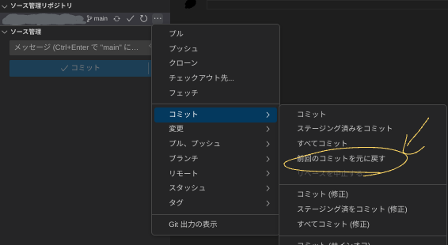

## はじめに

gitで間違えてコミットをしてしまい、削除、整理をしたいときの方法を解説します。

## プッシュ前

まだリモートにプッシュしていないのであれば以下のコマンドかvscodeの場合はGUI操作で取り消せます。

```bach
git reset --soft HEAD^
```

### vscodeの場合

1. ソース管理ボタン
2. リポジトリの横にある3つの点
3. コミットー>前回のコミットの取り消し



(vscodeの場合はGUIでgitの操作ができるのでコマンドを覚えなくても使えるので便利です。)

## リモートにプッシュしてしまった場合

### 1.戻したいコミットハッシュを取得する

これはgithubのページなどから取得できます。

### 2. 次のコマンドを叩く

```bach
git reset [コミットハッシュ]
```

### 3.戻したファイルがステージされるので要らなければ消す

### 4.強制プッシュ

```bach
git push origin [ブランチ名] --force
```

これでエラーが起きる場合のほとんどはブランチの保護ルールです。これを一旦解除するかもしくは他の方法を使用してください。

### 注意点

このように最後に強制プッシュをせざる負えないので複数人での作業時はやらないことを推奨します。また、履歴が消えるので本当にやらかした場合(APIキーを間違ってあげた)場合などを除き推奨できません。

## 最後に

このようにして完全に履歴を消去する方法はあります。しかし、gitは履歴を残して管理していくものなのであまりこのような手段は使うべきではなく、`git revert`などを使うべきです。ただし最終手段として知っておいてもいいと思います。また、個人での開発の場合はコミットの整理方法として知っておいてもいいと思います。(あまり乱用するとやらかすと思いますのでご注意ください。)
