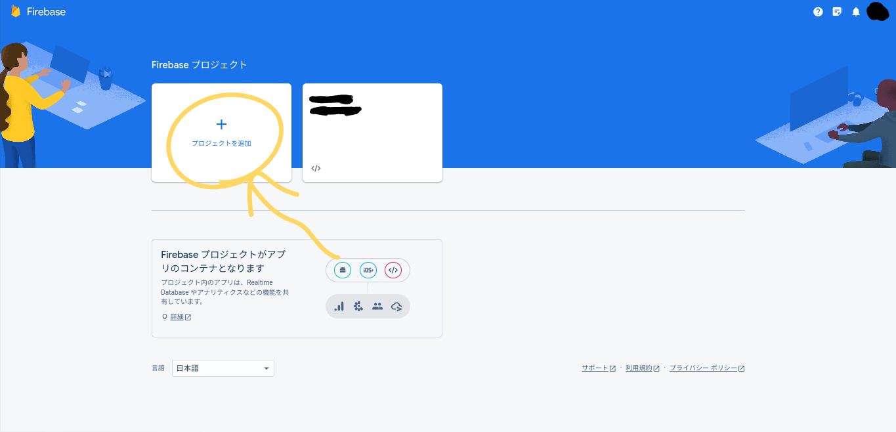
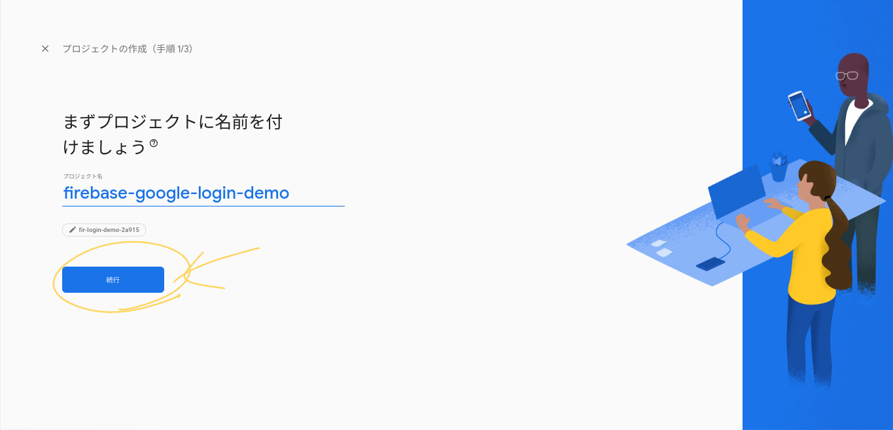
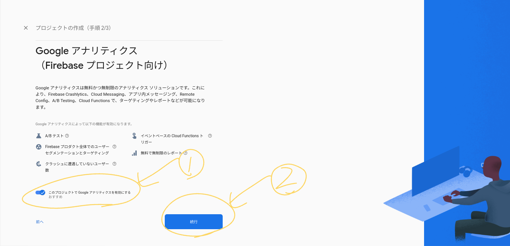
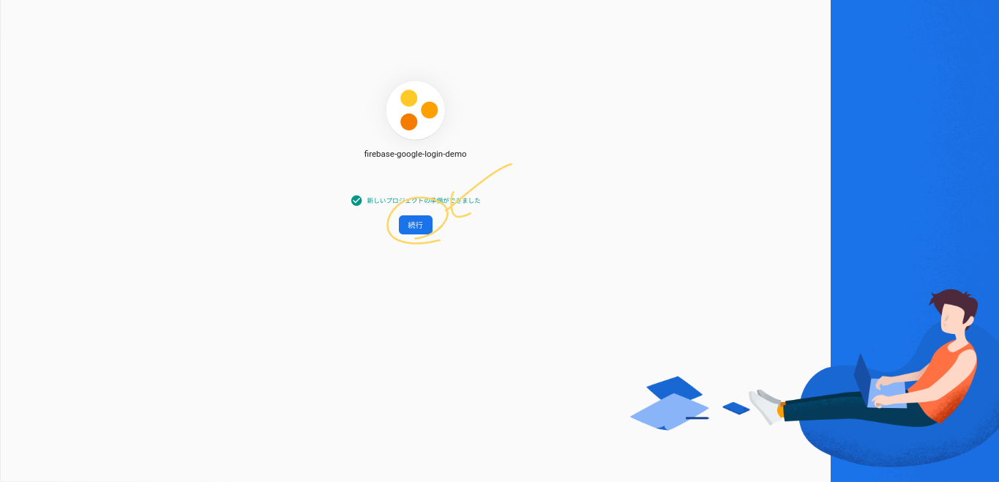
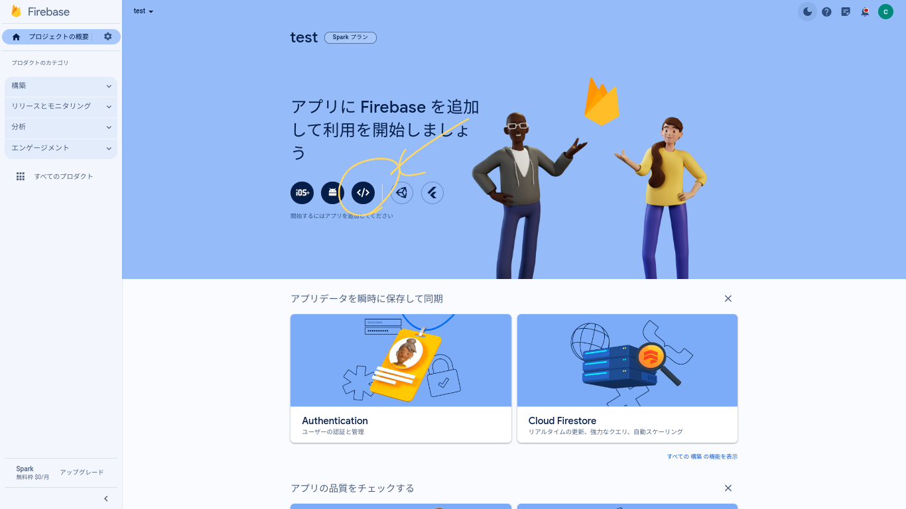
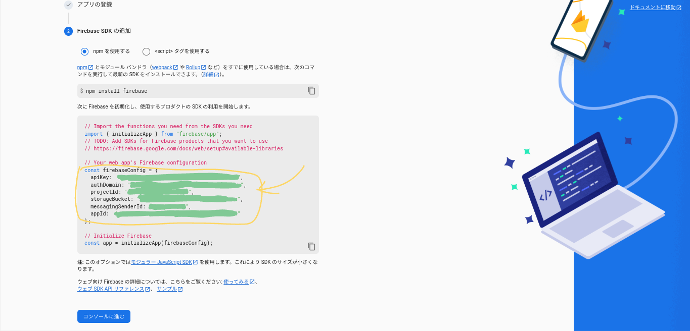

## 準備

* Googleアカウントを持っていなかったら登録する
* [firebase](https://console.firebase.google.com/)にアクセスする

### プロジェクトの作成の順序

#### 1.プロジェクト作成のボタンを押す



#### 2.名前を入力して次へを押す



#### 3. 続行(②)を押す

Google analyticsは使っても使わなくても大丈夫です。(使う予定があったらここでオンにするほうが楽です)



#### 4.続行ボタンを押す



#### 5.webボタンを押す



#### 6. ニックネームを適当につけてアプリを登録する

#### 7. Firebase SDKの画面になったらコードをすべてコピーしておく


<hr/>
ここでFirebase側の作業は終了です。次にVScodeなどのコードエディタに戻ってください
<hr/>

#### 8. firebaseのインストール

```bach
npm i firebase
# or
yarn i firebase
# or
pnpm i firebase
```

#### 9.firebase/index.tsを作成する

基本的に先程コピーしたコードをすべて貼り付けます

これで準備完了です。

## 最後に

これでNext.jsとFirebaseを接続できました。次回はメアドログイン機能を追加します。