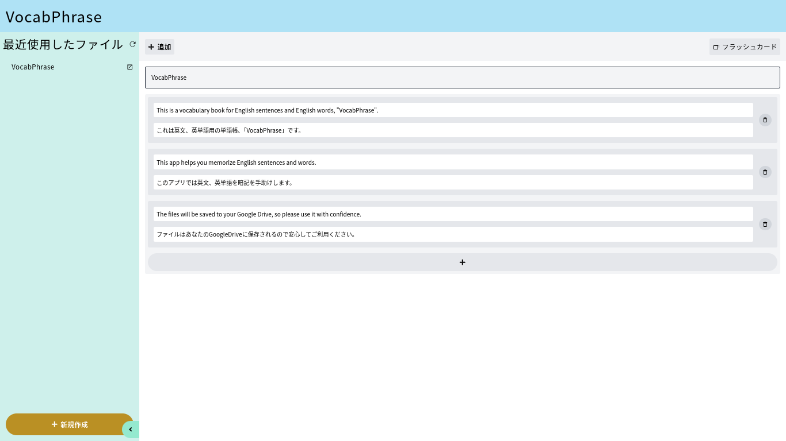
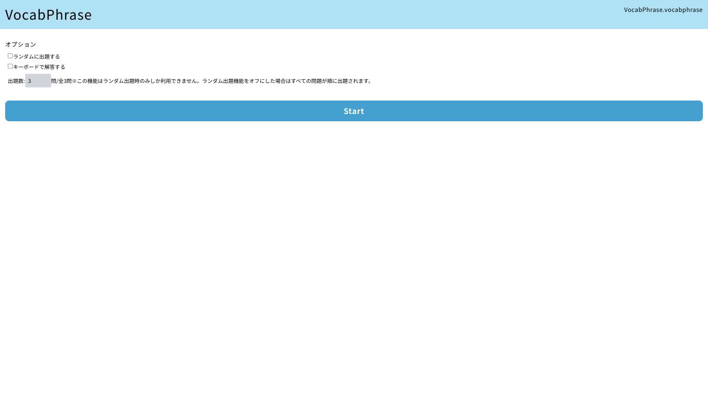
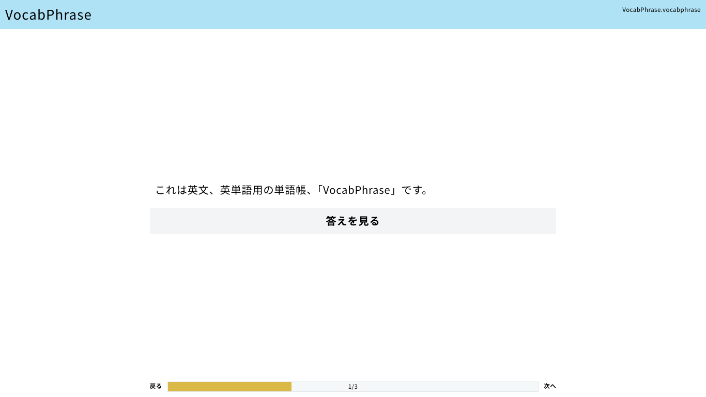
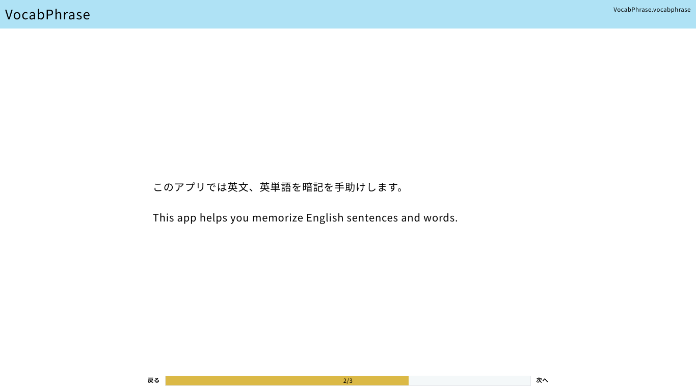

## はじめに

本日、英文、英単語専用の単語帳「[VocabPhrase](https://vocab-phrase.vercel.app/)」のα版をリリースしました。

## 特徴

webの単語帳アプリには色々なものがありますが、このアプリは以下のところが特徴です。

- 完全無料(無料で運営しているため)
- GoogleDriveに保存(勝手に公開されたりサービスが終了してファイルにアクセスできなくならない)

## 機能

α版(v0.0.1)時点での機能一覧です。

- 単語帳の作成(GoogleDriveの容量の許す限り作成可能)
- ローカルに保存したファイルを読み込み(未実装)
- フラッシュカードで暗記
- 学習履歴の保存(未実装)
- Googleスプレッドシート、Excelファイル、csvなどからのインポート(未実装)
- フラッシュカードでのキー入力、音声入力による解答(未実装)
- 英文中で入れなくても良い単語(`help O to do`の`to`など)を踏まえた判定(未実装)
- 英文の並べかえ、穴埋め問題機能(未実装)
- 単語帳を元に印刷できるテストを作成(未実装)

## スクショ

## 技術的な内容

フレームワークはいつもどおり`Next.js`を使いました。また、GoogleDriveとの連携はGoogleDriveAPIを使用しましたがこれが一番苦労しました。これについては[こちらの記事](./20231225-google)で詳しく解説しています。
