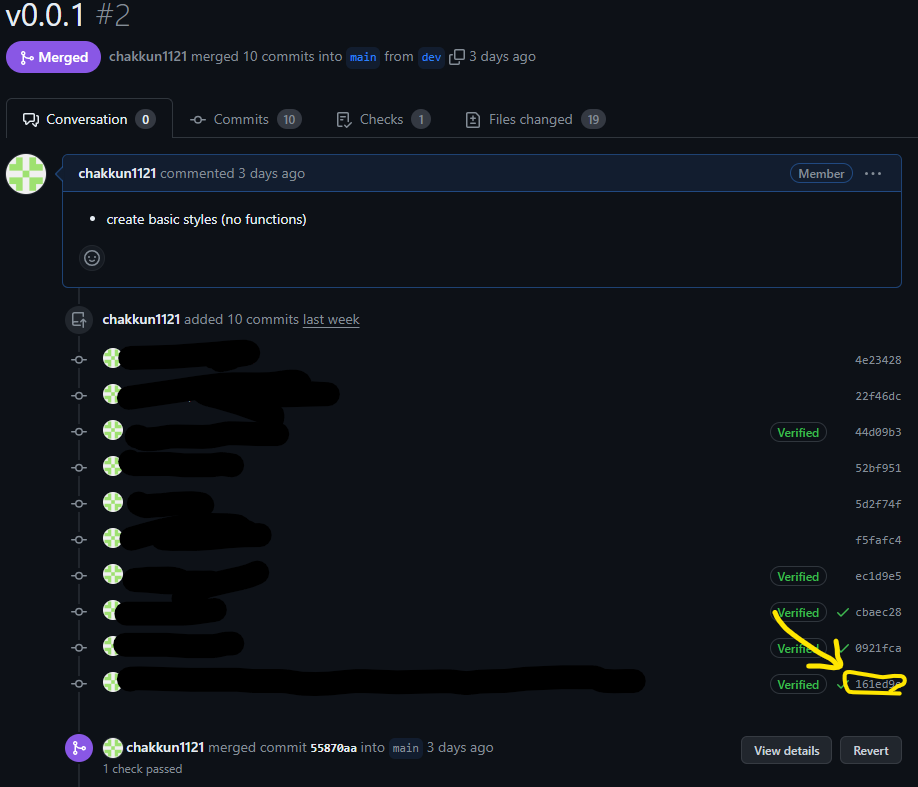
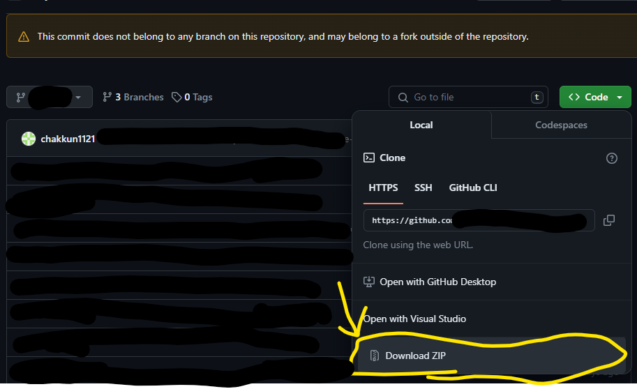

## コミット後に戻す方法

まずはリセットした際の履歴を確認します。

```bash
git reflog
```

ここで履歴が出てこない場合はあとから説明する方法で直します。

履歴を確認したら、以下の方法で戻します。

```bash
git reset --hard HEAD@{1}
```

## 元のリポジトリをローカルから消してしまった場合

この場合は上記の方法ではログが出てこないので、githubの場合は以下の方法で確認します・

1. (closeしていてもいいので)間違ってリセットしてしまったコミットが含まれているプルリクエストを探す。
2. コミットハッシュのリンクをクリックする



3. リンクからコミットハッシュを取得し、フォルダーをzipとしてダウンロードする。



## 最後に

このようにすることで、リセットした際の履歴を確認し、戻すことができます。ただし、この処理は大変なのでリセットする際には慎重に行い、できるだけ強制プッシュは避けましょう。
